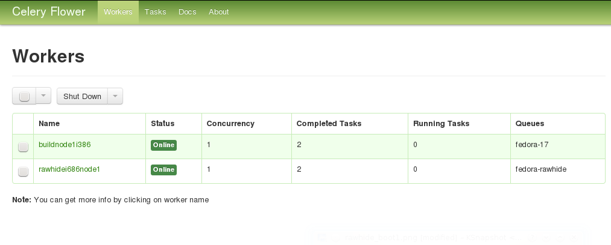
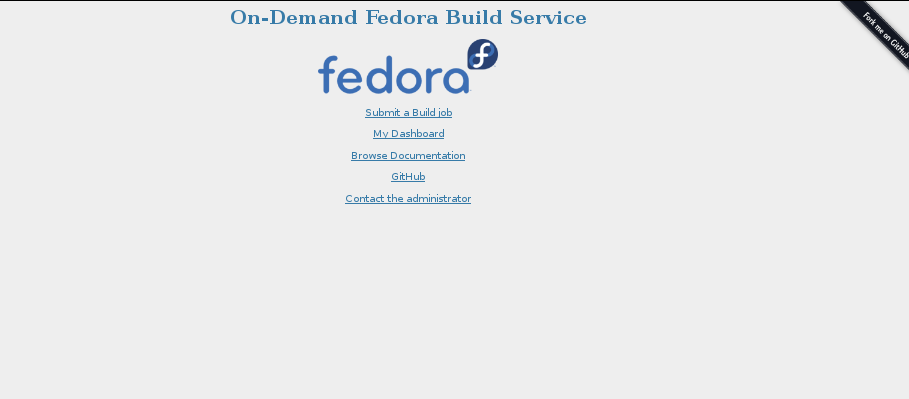
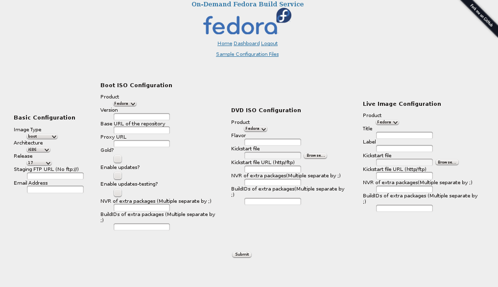

===============
Getting Started
===============
This document aims to get you started with using and deploying the
**On-Demand Fedora Build Service**, an effort to make Fedora image
building easier. Using this service you can make *boot iso, DVD iso*
and *live images* of Fedora_ Linux. 

The service can be used in two modes: 

1. Local mode
2. Distributed mode

In *local mode*, all the work is done on the local machine, whereas in
*distributed mode*, the build job is distributed across multiple build
*nodes* and building images for multiple Fedora releases and
architecture is supported. 

Local Mode
==========
The *local mode* involves minimum setup requirements and is easy to get
started with. If you intend to deploy the service across multiple
nodes, the *local mode* is a good way to smoke test the working of the
service. Let's get staretd:

1. Clone the source from the git repository_ using ``$ git clone git://github.com/amitsaha/gsoc2012_fbs.git``
2. Install fabric_ using ``$sudo yum install fabric``
3. Navigate to the cloned source repository (``gsoc2012_fbs``). You will see a *fabric fabfile*, ``fabfile.py`` (basically a symbolic link to ``deploy.py`` - the real script)


To setup everything you need for running the image building service
in local mode, excute ``$ fab deploy_local``, which should ask for your
``sudo`` password as it installs the packages needed for running the
image building service, installs the package, ``image_builder`` and
another setup requirement.

Now you are ready to using the image building service. Navigate to the
``cli/`` directory in the source tree. The file
```build_cli_basic.py``` is a command line client to build a Fedora
image as per your specifications. Here is a quick overview of how to
specify a *boot iso*::

       [DEFAULT]
       type=boot
       arch=x86_64
       release=17
       staging=10.0.0.27
       #staging=file:///tmp/staging
       email=amitsaha.in@gmail.com

       [boot]
       product=fedora
       release=17
       version=1
       updates=0
       updates-testing=0
       17_url=http://download.fedoraproject.org/releases/17/Everything/x86_64/os
       17_mirror=http://mirrors.fedoraproject.org/metalink?repo=fedora-17&arch=x86_64
       #17-updates_url=http://download.fedoraproject.org/updates/17/i386
       #17-updates_mirror=https://mirrors.fedoraproject.org/metalink?repo=updates-released-f17&arch=i386
       proxy=
       nvr=package1;packag2;
       bid=package3;packag4
       outdir=/tmp/lorax_op
       workdir=/tmp/lorax_work
       
The ``[DEFAULT]`` section of the configuration contains the following
information:

``type`` 
    Type of image to be built, has to be one of ``boot, dvd, live``

``arch``
    Architecture of the image. Note that, if you are on a ``i686``
    node, you will only be able to build an image of that type. Valid
    values are ``i686, x86_64``

``release``
    The Fedora release of the image to be built. It should be the same
    as the release of fedora you are running, else unexpected things
    may happen.

``staging``
    This is where your built images will be stored once
    completed. There are two options: local file system (specified via
    ```file:///foo/bar```) or a FTP server with anonymous access
    specified via the IP address of the server

``email``
    An email address for image building notification. This isn't active
    in local mode (although you can activate it using a simple change
    to the client code, ``build_cli_basic.py```, which we learn more
    about a little later).

The ``[boot]`` section specifies the options which are specific to
lorax_, Fedora's image creation tool. The ``product`` option specifies
the name of the Boot ISO being created, usually ``fedora``. The
``release`` option is the same as above. The ``version`` name
specifies the version of the ISO being built. 

The next few options describe the ``repository`` and ``mirrorlists``.
The ``updates`` and ``updates-testing`` repository can be
enabled/disabled by setting them to ``1`` or ``0``,
respectively. The release repository and mirror is specified via the
options ``{release}_url`` and ``{release}_mirror`` (where ``release``
is the above specified value). If you have enabled any or both of
``updates`` or ``updates-testing``, you have to specify the repository
and mirror list for them as well. Incase you have a ``proxy`` setup
for your repositories, specify it here (**untested**).

Incase you want to include packages which are not yet there in any of
the repositories, you may specify them via their ``NVR strings`` or
``Koji build IDs`` using the next two options: ``nvr`` and ``bid``. If you don't have any
such requirements, just leave them blank. The packages will be pulled
in from Koji_ and included in your image.

Finally, ``lorax`` requires an output directory where it places the
image it builds. You can specify it using ``outdir``. The ``workdir``
option is used to specify a directory which will be used by the image
building code to download the extra packages and create a side
repository (if any). 

Now, you may save the above specification in a file called,
``boot_imagebuild.conf``. Next, execute the ``build_cli_basic.py``
script using ``$sudo python build_cli_basic.py
/location/for/boot_imagebuild.conf``, which should trigger the build
process::

       Initiating Build Process. See /tmp/imagebuild_13446647457.log for progress
       checking for root privileges
       checking yum base object
       setting up build architecture
       setting up build parameters
       installing runtime packages
       ..

If you check the specified log file, you should see messages like::

       2012-08-11 16:07:58,798 - Registered a new Image Build request from amitsaha.in@gmail.com
       2012-08-11 16:07:58,798 - Image type:: boot
       2012-08-11 16:07:58,800 - Starting the Image Build Process
       2012-08-11 16:07:58,800 - Creating side repository
       2012-08-11 16:07:58,803 - Downloading packages for Side repository
       2012-08-11 16:08:17,350 - Side repository created
       2012-08-11 16:08:17,353 - All set. Spawning boot iso creation using lorax.
       2012-08-11 16:28:39,101 - Boot ISO built succesfully
       2012-08-11 16:28:39,118 - Image building process complete
       2012-08-11 16:28:39,118 - Image successfully created. Transferring to staging.
       2012-08-11 16:28:39,118 - Initiating local transfer of image(s) to /tmp/staging
       2012-08-11 16:28:43,238 - Initiating local transfer of logs to /tmp/staging
       2012-08-11 16:28:43,895 - Image(s) and logs available at file:///tmp/staging

The ``boot_imagebuild.conf`` file that was used had the following
contents::

      [DEFAULT]
      type=boot
      arch=x86_64
      release=17
      #staging=10.0.0.27
      staging=file:///tmp/staging
      email=amitsaha.in@gmail.com
      [boot]
      product=fedora
      release=17
      version=17
      updates=0
      updates-testing=0
      17_url=http://download.fedoraproject.org/releases/17/Everything/x86_64/os
      17_mirror=http://mirrors.fedoraproject.org/metalink?repo=fedora-17&arch=x86_64
      #17-updates_url=http://download.fedoraproject.org/updates/17/i386
      #17-updates_mirror=https://mirrors.fedoraproject.org/metalink?repo=updates-released-f17&arch=i386
      proxy=
      nvr=wget-1.13.4-4.fc17
      bid=
      outdir=/tmp/lorax_op
      workdir=/tmp/lorax_work


If you compare the logging messages and the image build specification,
you will see that I have specified an extra package to be pulled in
from Koji using a NVR string and hence the messages regarding
side-repository creation. 

Similarly, you can also build ``DVD`` and ``Live images`` using this
command line client and the appropriate specifications. For sample
specification for these, see the ``conf/`` directory in the checked
out sources. 

It should be kept in mind that **all** the options must be specified
in the configuration files as in the samples given. It is therefore
recommended that you use one of the sample configuration files to
build your own. A simple configuration file generator will soon be
made available.

.. _Fedora: http://fedoraproject.org
.. _repository: http://github.com/amitsaha/gsoc2012_fbs
.. _fabric: http://docs.fabfile.org/en/1.4.3/index.html
.. _lorax: http://git.fedorahosted.org/cgit/lorax.git/
.. _Koji: http://koji.fedoraproject.org/koji/


Distributed Mode
================

The distributed mode enables deployment of the code on multiple nodes
and dare we say, in production. The advantages of this mode include
support for building images for different Fedora releases and
architecture. Also, your local machine will not be hogged with
building images. Let's see how we can deploy the build service in this
mode.

Deployment Configuration
------------------------

First, the deployment configuration is specified via the file
``conf/deploy.conf``::

      [broker]
      i686="amqp://guest@10.0.0.30//"
      x86_64="amqp://guest@10.0.0.27//"

      [releases]
      releases=17,rawhide

      [master]
      host=gene@localhost
      workdir=/tmp/imagebuilder_webapp

      [workers-17]
      i686=root@10.0.0.30
      x86_64=root@10.0.0.27
      workdir=/tmp/imagebuilder_worker

      [workers-rawhide]
      i686=root@10.0.0.37
      x86_64=root@10.0.0.43
      workdir=/tmp/imagebuilder_worker

      [SMTP]
      #replace these with appropriate credentials
      #single quotes needed
      server='smtp.gmail.com'
      port='587'
      login='bot@gmail.com'
      password='f00bar'

Let us understand this configuration file's sections and options.

``broker``
     The ``url`` of the message broker is specified here. This is used
     by Celery_, which is used to distribute the build jobs. As
     you can see, RabbitMQ_ is used as a broker in this
     case. Currently, two brokers are used: one for the ``i686`` build
     nodes and another for ``x86_64`` build nodes. The
     assumption is that these URLs will point to one of the
     appropriate worker nodes specified later. For example, the
     ``i686`` broker URL should point to a ``i686`` worker node
     and similarly for the ``x86_64`` URL. 

``releases``
     Specify the supported releases here.

``master``
     This section specifies the ``user@host`` string (in the ``host``
     option) of the node which will be the *master* node of the build
     service. This node will host the Web application that users of
     this service will use to submit build requests. SSH server should
     be running on this server to enable deployment and firewall rules
     appropriately set to allow incoming connections on
     port 5000. The ``workdir`` option specifies the directory where
     the web application will be hosted from.

Next, the build node configurations are specified. Depending on the
number of supported releases, there will be one or more sections - one
for each supported release, with section names of the form
``worker-{release}``, where ``release`` is one of the values
specified in ``releases`` above.

``worker-{release}``
     This section should specify the ``root@host`` strings for workers
     supporting ``i686`` and ``x86_64`` image building using the
     appropriate options. Each worker section should have *both*
     specified. Multiple ``user@host`` strings should be seperated
     via a ; (semicolon). The ``workdir`` option specifies the directory where
     the deployment of the build service will take place from. 

``SMTP``
    This section specifies the SMTP server configuration which will be
    used for sending notification emails to the job requester.
      

.. _Celery: http://docs.celeryproject.org/en/latest/index.html
.. _RabbitMQ: http://www.rabbitmq.com/


Deployment using Fabric
-----------------------

Once this configuration file is ready, the fabric script
``fabfile.py`` will be used to deploy the service. Let us see the
tasks that are currently available in the script (assuming you are in
the source root)::

      $ fab --list

      This is a fabfile (http://docs.fabfile.org/en/1.4.2/index.html)
      to deploy On-Demand Fedora Build Service.
      See doc/ for usage guidelines.

      Available commands:

          copy_files_webapp         Copy files to the web application host
	  copy_files_workers        Copy the files to the workers
	  deploy_local              Deployment in local mode
	  deploy_webapp             Deploy the web application (and enable REST API)
	  deploy_workers            Deploy the workers
	  install_packages_webapp   Install dependencies for the web application
	  install_packages_workers  Install dependencies on the workers
	  setup_cli                 Deployment for using the command line client in distributed mode

Deploying the Workers
---------------------

First, let us deploy the workers. We shall first copy the appropriate
files to the worker, install the necessary packages and then finally
start the worker processes (root access to all the workers is
required). We run the corresponding taks via ``fabric``::

      $ fab copy_files_workers install_packages_workers deploy_workers
      [root@10.0.0.37] Executing task 'copy_files_workers'
      [root@10.0.0.37] run: rm -rf /tmp/imagebuilder_worker
      [root@10.0.0.37] Login password for 'root': 
      ..
      ..


It will take a while before all the taks are completed and provided
there are no errors, your workers should now be up and ready to
build. Assuming that the above deployment completed without any
errors, you can do a simple check to verify whether the workers are up
and running using flower_ (a web-based tool for monitoring
celery workers.). In your browser, open the URL ``http://<ip>:8008``,
where ``<ip>`` can be any of the worker node IPs. If the IP address
you chose is one of the ``i686`` nodes' IPs, then you should see a
webpage showing *all* the ``i686`` nodes you specified. For example,
the following screenshot shows a sample flower interface:




If you do not see *all* of the nodes you specified for the specified
architecture, something is wrong, and should be investigated.

Now that the workers are deployed, let us now explore the options
currently available for submitting an image build task.

Command line
------------
A command line client, ``build_cli.py`` is available in the ``cli/`` directory of the
source tree. Its usage is same as the command line client in local
mode, ``build_cli_basic.py``. However, before you can start using the
command line client you you will need to setup your client computer
using the fabric script we used earlier. 

From the source tree root, execute ``$ fab setup_cli``. You will
notice that it installs a few dependencies and also writes a file,
``cli/nodes.conf``. This file contains the information regarding the
message brokers we discussed earlier. The client will use the message
brokers to communicate with the workers. Once this has been completed,
you can now submit a new build request::
     
      python build_cli.py ../conf/boot_imagebuild.conf 
      Sending build task to worker

If all goes well, you should get an email at the email address you
specified in the config file of the form::

      Your Image Building Request have been submitted. You may monitor
      the progress by going  to http://10.0.0.27:5100/log/tmp/imagebuild_134473790944.log.
      You will also recieve an email upon completion.

As you can see, the build job is being carried out by a worker node
with the IP address: ``10.0.0.27``. And you can monitor the progress
by clicking that link. Once the job has completed, you should get an
email saying that your job has been completed and the log messages. If
you specified a FTP server to copy the images to, the image should be
available there with a timestamp suffixed to the filename. If there
was an error in your image build task, the email will tell you the
same.

Note::

     As of now, there seems to be an yet unsquished bug which sometimes
     prevents you from seeing the log files. This has something to do
     with ``Celery's`` logging and the image builder's logging. In that
     case, the best bet is to just wait till you get a job completion
     email and check your staging area for the image(s)/logs.

Its important that you specify a anonymous writable FTP server as your
staging area here, since otherwise you will have to get the image/logs
by logging into the worker node. 

It is to be noted that you can use this client from any computer which
can access the worker nodes. 


Web and REST API interface
--------------------------------

You can also submit your image building jobs via the web
application. Let's see how you can set this up. Deploying the web
application will involve three steps: copy the files to the web
application host computer, install the packages and then finally start
the web application. Once again, we use the fabric script to carry
these steps::

     $ fab copy_files_webapp install_packages_webapp deploy_webapp
     [gene@localhost] Executing task 'copy_files_webapp'
     [gene@localhost] run: sudo rm -rf /tmp/imagebuilder_webapp
     [gene@localhost] Login password for 'gene': 
     [gene@localhost] out: [sudo] password for gene: 

     [gene@localhost] run: mkdir -p /tmp/imagebuilder_webapp
     [gene@localhost] put: /home/gene/work/gsoc2012_fbs/setup.py -> /tmp/imagebuilder_webapp/setup.py
     ..

Once these steps have been completed successfully without errors, you
can now point your browser to ``<master>:5000/``, where
``<master>>`` is the IP address of your web application host as
specified in the ``deploy.conf`` file.

Once you are there, you should see the following interface:



The first link allows you to submit a new image build job. Note that
it requires you to have a *Fedora Account System*(FAS_) login. So, if
you don't have one, please create one.



The options on the Web UI are similar to what you specified in the
configuration files earlier. You choose the type of
image, the architecture, staging, release, etc. Once you hit ``Submit``,
you should get an email notification similar to the previous
section. If you get an email saying *Try again..*, please do so.

The *Dashboard* page which is currently not implemented will have
your details of your past and present build jobs submitted.

The web application also exposes a **REST API** endpoint
``<master>:5000/rest`` which can be then accessed via a REST client to
send build requests. An example client is ``cli/build_rest.py`` which
is to be invoked similar to the other command line clients,
i.e. ``python build_rest.py <config file>``. 

Please note::
     The REST API is currently insecure, i.e. there is not integration
     with FAS. If you consider this a security risk, do not expose
     this. Simply disable it in the web application, ``webapp/app.py``.

Both the web interface and the REST API has the advantage that they
allow submitting build requests from any other device having access to
the network without any of dependencies required to be installed for
the command line client in the previous section.

.. _flower: https://github.com/mher/flower
.. _internals: internals.html
.. _FAS: https://admin.fedoraproject.org/accounts
